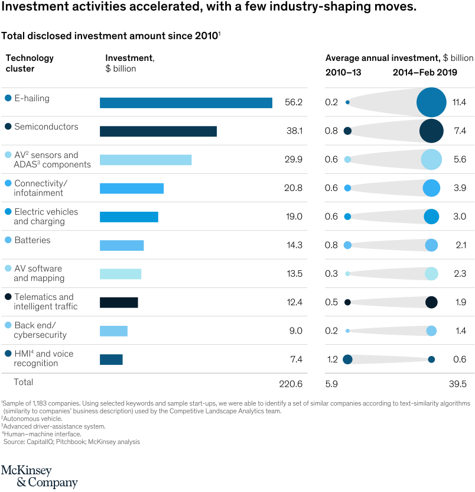
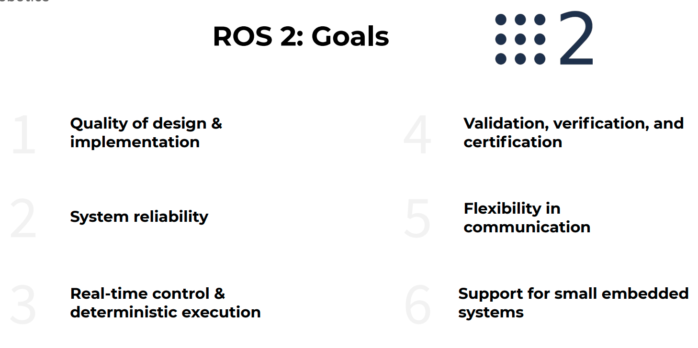
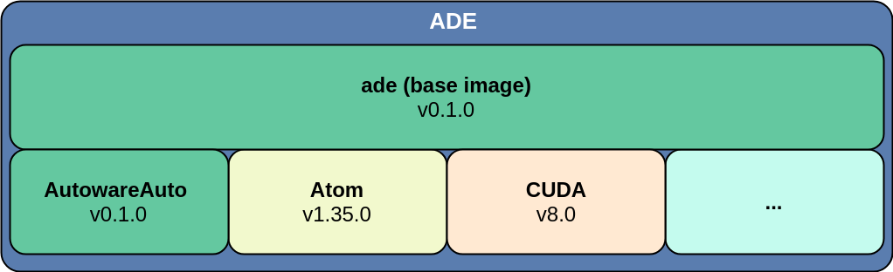

# Course introduction
1. See [this video](https://youtu.be/kn2bIU_g0oY?t=87) for discussion of Autoware's capabilities, implementation and future plans.

    

---

## Why are we offering this course

1. Autonomous driving (AD) is a [mega trend](https://www.mckinsey.com/industries/automotive-and-assembly/our-insights/the-future-of-mobility-is-at-our-doorstep). Software for autonomous driving alone has seen an average investment of $2.3B in the last 5 years.

    

1. One of the major enablers for developing autonomous driving applications, ROS, [has matured](https://5b181759-ea8b-4c40-9a5e-15528567eec6.filesusr.com/ugd/984e93_a900ef136b0543afb3f06d7923be90d4.pdf?index=true) and the [ROS 2](https://index.ros.org/doc/ros2/) version can now be productized.

    

1. Likewise, Autoware has [also graduated](https://5b181759-ea8b-4c40-9a5e-15528567eec6.filesusr.com/ugd/984e93_908f1e8482fd4729b36d078a924d9743.pdf) from the research and prototyping phase, and the next version, [Autoware.Auto](https://gitlab.com/autowarefoundation/autoware.auto/AutowareAuto) is being developed with much greater rigor and use in commercial applications an explicit goal.

1. Developing an autonomous driving system is hard and requires huge financial and developer resources. With the technologies presented in this class (ROS 2 and Autoware.Auto), the users can focus on what differentiates them - an actual autonomous driving application like an autonomous taxi, highway autopilot, autonomous valet parking, and so on.

     

1. ROS 2 and Autoware.Auto are new technologies. This course provides fast and high quality shortcut to mastering them.

---

## How will the course work

### Prerequisites

1. Familiarity with ROS 1 (or any other robotics framework) and intermediate C++
1. Knowledge of linear algebra, calculus and statistics. An ideal student will be familiar with the theoretical aspects of perception, localization, planning, control, state estimation and decision making as taught by, for example, [Udacity's Nanodegree Program](https://www.udacity.com/course/self-driving-car-engineer-nanodegree--nd013).
1. Hardware: The only performance limitation comes from the Unity-based simulator. For its requirements please see [the simulator's documentation](https://www.lgsvlsimulator.com/docs/faq/#what-are-the-recommended-system-specs-what-are-the-minimum-required-system-specs).
1. Software: Ubuntu 18.04

---

### Schedule
1. The course will commence on Monday, May 11 2020. New lectures will be made available weekly. For a detailed schedule see the [course website](https://www.apex.ai/academy-autoware)'s Course Overview page.

---

### Material
The course will consist of video lectures uploaded to [Youtube](https://www.youtube.com/channel/UCyo9zNZTbdJKFog2q8f-cEw) and slides and lab material available for download from the [course website](https://www.apex.ai/academy-autoware)'s Course Overview page.

---

### Feedback
If you have questions regarding the course content or if you have recommendations for improvement please submit feedback via the [course website](https://www.apex.ai/academy-autoware)'s Feedback page.

---

## What will the course offer
The course is organized in partnership with the members of the [Autoware Foundation](https://www.autoware.org/) and of the ROS community. These are world-leading experts in the domains of software middlewares, software frameworks, and algorithms and tools for autonomously driving cars. In the course you will learn how to practically build a working AD stack to perform autonomous valet parking (AVP).

### Syllabus
A short review of the course syllabus is available [here](https://www.apex.ai/academy-autoware).

### Lecture structure
Every lecture will have the following structure:
1. Theoretical background
1. Programmatic examples
1. Systematic examples

At the end of every lecture students will be able to run pre-prepared examples, modify them and build their own parts of the autonomous driving stack.

# Quick start - development environment
## Install ADE (Awesome Development Environment)
In this course we will use [ADE](https://ade-cli.readthedocs.io/en/latest/). This will ensure that all students in the course have a common, consistent development environment.



### Docker
The requirement for ADE is to install docker, please follow: https://ade-cli.readthedocs.io/en/latest/install.html#requirements.

To install ADE on your Ubuntu 18.04 computer, execute the following steps or [follow the installation instructions from the ADE documentation](https://ade-cli.readthedocs.io/en/latest/install.html):

```sh
$ cd ${HOME}
$ mkdir adehome
$ cd adehome
$ wget https://gitlab.com/ApexAI/ade-cli/uploads/85a5af81339fe55555ee412f9a3a734b/ade+x86_64
$ mv ade+x86_64 ade
$ chmod +x ade
$ mv ade ~/.local/bin
$ which ade
# Update ade
$ ade update-cli
# Now setup ade
$ touch .adehome
$ git clone --recurse-submodules https://gitlab.com/autowarefoundation/autoware.auto/AutowareAuto.git
$ cd AutowareAuto/
$ ade start
# this will take awhile
$ ade enter
```

Now you should see the following in your prompt:

```sh
<your_username>@ade:~$
```

**Note:** From now on we will preface command line instructions with `$` or `ade$` to indicate whether the commands should be run in a plain terminal or inside the ADE environment.

## Install ROS 2
Autoware.Auto uses ROS 2 Dashing, which is already [installed](https://gitlab.com/autowarefoundation/autoware.auto/AutowareAuto/-/blob/master/tools/ade_image/apt-packages#L19) inside ADE. The installation directory is `/opt/ros/dashing/`. For instructions on installing ROS 2 from scratch please refer to [the ROS documentation for ROS 2 Dashing](https://index.ros.org/doc/ros2/Installation/Dashing/).


You can confirm the installation by running the following command:

```sh
ade$ ros2 -h
```

You can also try to run the talker/listener example, using two separate terminals.

```sh
ade$ ros2 run demo_nodes_cpp talker
```

```sh
ade$ ros2 run demo_nodes_cpp listener
```

If you want to install additional system packages inside ADE you can use the `apt` package management tool.

```sh
ade$ sudo apt update
ade$ sudo apt install ros-dashing-turtlesim
ade$ sudo apt install ros-dashing-rqt-*
ade$ sudo apt install byobu
```

**Note:** Installation of system packages does not persist between `ade stop`  and `ade start` commands. Anything valuable that needs to persist should be placed in the `adehome` directory, which is stored on the host and mounted in the ADE environment.

## Install Autoware.Auto

### Binary version
Autoware.Auto is already installed inside ADE. The installation directory is `/opt/AutowareAuto/`, which is provided as a [docker volume](https://ade-cli.readthedocs.io/en/latest/create-custom-volume.html?highlight=volume).

### From source version
For [installation from source](https://autowarefoundation.gitlab.io/autoware.auto/AutowareAuto/installation-and-development.html#installation-and-development-how-to-build) you can use the previously cloned version and run the following commands:

```sh
ade$ cd AutowareAuto
ade$ colcon build
ade$ colcon test
ade$ colcon test-result
```

## Run object detection demo

Now you are ready to run one of the canonical applications of Autoware.Auto, a LiDAR-based object detection pipeline.

### Prerequisites
1. [Download a pre-recorded pcap file](https://drive.google.com/open?id=1vNA009j-tsVVqSeYRCKh_G_tkJQrHvP-) and put it in `${HOME}/adehome/data`.
2. Clone the lecture-specific configuration files:
    ```sh
    ade$ git clone https://gitlab.com/ApexAI/autowareclass2020.git ~/autowareclass2020
    ```

Execute each of the following commands in a new ADE terminal.

**Note**: It is necessary to source the Autoware.Auto workspace before each of the following commands. You can do this by executing `source /opt/AutowareAuto/setup.bash` in the ADE terminal.

```sh
ade$ udpreplay ~/data/route_small_loop_rw-127.0.0.1.pcap
ade$ rviz2 -d /home/${USER}/autowareclass2020/code/src/01_DevelopmentEnvironment/aw_class2020.rviz
ade$ ros2 run velodyne_node velodyne_cloud_node_exe __ns:=/lidar_front __params:=/home/${USER}/autowareclass2020/code/src/01_DevelopmentEnvironment/velodyne_node.param.yaml
ade$ ros2 run robot_state_publisher robot_state_publisher /opt/AutowareAuto/share/lexus_rx_450h_description/urdf/lexus_rx_450h.urdf
ade$ ros2 run point_cloud_filter_transform_nodes  point_cloud_filter_transform_node_exe __ns:=/lidar_front __params:=/opt/AutowareAuto/share/point_cloud_filter_transform_nodes/param/vlp16_sim_lexus_filter_transform.param.yaml __node:=filter_transform_vlp16_front points_filtered:=/perception/points_in
ade$ ros2 run ray_ground_classifier_nodes ray_ground_classifier_cloud_node_exe __ns:=/perception __params:=/opt/AutowareAuto/share/autoware_auto_avp_demo/param/ray_ground_classifier.param.yaml
ade$ ros2 run  euclidean_cluster_nodes euclidean_cluster_exe __ns:=/perception __params:=/opt/AutowareAuto/share/autoware_auto_avp_demo/param/euclidean_cluster.param.yaml
```

The result should look like this:


## Edit and compile your code

Now we shall look at how you can create a new Autoware.Auto package, edit it, and compile it.

1. Create a new package
    ```sh
    ade$ cd ~/AutowareAuto/src
    ade$ autoware_auto_create_pkg --destination . --pkg-name autoware_my_first_pkg --maintainer "Dejan Pangercic" --email dejan@apex.ai --description "My first Autoware pkg."

    ```
2. Edit a file
    ```sh
    ade$ emacs -nw autoware_my_first_pkg/src/autoware_my_first_pkg_node.cpp
    # Edit one Line
    ```
3. Recompile and execute
    ```sh
    ade$ cd ..
    ade$ colcon build --packages-select autoware_auto_autoware_my_first_pkg
    ade$ source install/setup.bash
    ade$ ros2 run autoware_auto_autoware_my_first_pkg autoware_my_first_pkg_exe
    ```

Congratulations! Now you have a white belt in Autoware.Auto.

# Next lecture

In the next lecture you will learn about the theory of automotive and robotics code development and some of the best practices used for the development of Autoware.Auto.
