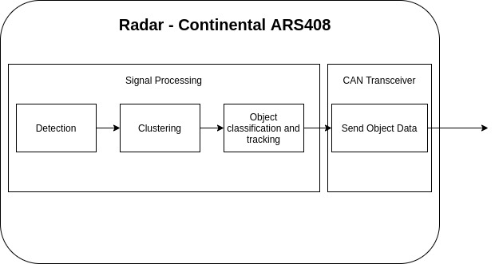
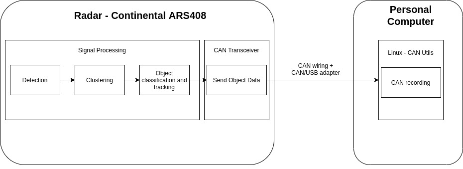
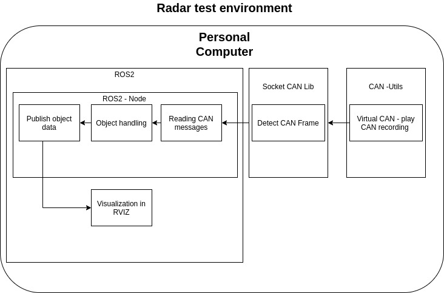
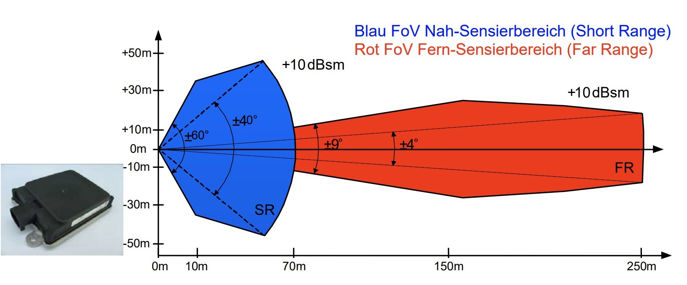
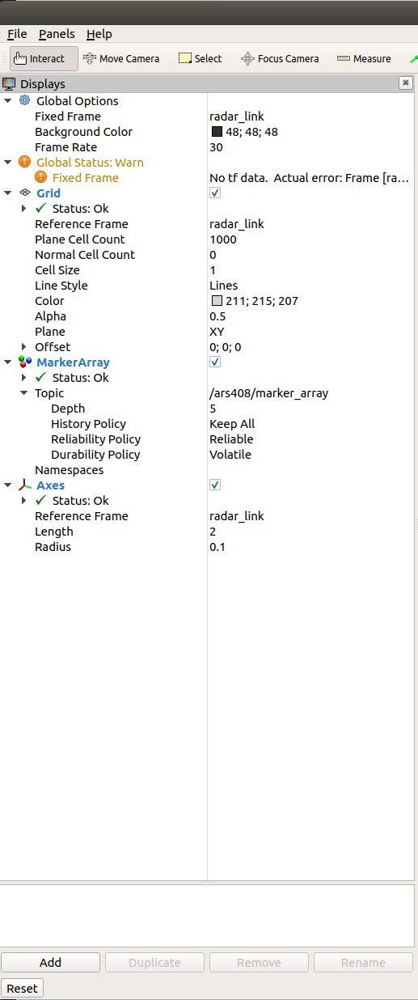

<div class="row" style="margin-bottom:2px;width:100%;text-align:center;">
  <div style="position:relative;float:left;padding-top:15px;">
    
    <!-- <br clear="all" /> -->
  </div>
  <div style="width:90%;position:absolute;height:1px;margin:auto;left:50px;bottom:0;top:0;margin-left:25px;border:1;">
    <p style="font-size:30pt;color:green;">Self-Driving Cars with ROS and Autoware</p>
    <p style="font-size:20pt;color:black;">Object Perception: Radar -- Hands-On</p>
    <p style="font-size:15pt;color:black;">Daniel Peter</p>
    <p style="font-size:15pt;color:black;">FH Aachen University of Applied Sciences, Aachen, Germany</p>
  </div>
</div>

<br />

# How to create a ROS2 Node for a ARS408 Radar sensor

<br />

## Learning Goals / Tasks
In this project a ROS2 node is to be developed, which reads the data of a Continental ARS408 sensor and publishes them as object messages. The objects shall be displayed within RVIZ2.
An original CAN recording of the sensor will be provided.
You will learn:
- how to create a ROS2 Node with Lifecycle
- how to access CAN Data via SocketCAN and how to handle them
- how to visualize object data via RVIZ2
- to understand radar data

## Source location
The source code is located at: \
https://gitlab.com/ApexAI/autowareclass2020/-/tree/master/code/src/09_Perception_Radar \
There you will find the workspace to work on and the solution workspace.


## Prerequisites

Follow the install instructions for Docker: https://docs.docker.com/engine/install/ubuntu/#install-using-the-repository 

Follow the install instructions for the ADE: https://autowarefoundation.gitlab.io/autoware.auto/AutowareAuto/installation.html#installation-and-development-install-ade

If you have problems with an nvidia system (run RVIZ in ade): https://gitlab.com/autowarefoundation/autoware.auto/AutowareAuto/-/issues/502

Install Can Utils on your host system (candump etc.):
```bash
$ sudo apt-get install -y can-utils
$ sudo apt install net-tools
```

and install these in your ade, too:
```bash
ade$ sudo apt-get install -y can-utils
ade$ sudo apt install net-tools
```


Download radar template and create inside the adehome folder your ROS2 workspace:
```bash
$ mkdir OnlineClass_radar_ars408
$ cd OnlineClass_radar_ars408
$ mkdir src
$ cd src
//copy the Radar project into the source directory 
$ cd ..
```

You should be back inside your project directory. Now you can use rosdep to download ros2 packages, which will be used for this project like the lifecycle lib:
```bash
ade$ rosdep install --from-paths src --ignore-src -r -y
```

Now you should have a project folder with the following structure:


├── CAN_Recording\
│&ensp;&ensp;&ensp;└── candump.log\
├── radar_conti_ars408\
│&ensp;&ensp;&ensp;└── src\
│&ensp;&ensp;&ensp;&ensp;&ensp;&ensp;&ensp;├── CMakeLists.txt\
│&ensp;&ensp;&ensp;&ensp;&ensp;&ensp;&ensp;├── include\
│&ensp;&ensp;&ensp;&ensp;&ensp;&ensp;&ensp; |&ensp;&ensp;&ensp;├── ars_408_can_defines.h\
│&ensp;&ensp;&ensp;&ensp;&ensp;&ensp;&ensp; |&ensp;&ensp;&ensp;├── radar_conti_ars408_component.hpp\
│&ensp;&ensp;&ensp;&ensp;&ensp;&ensp;&ensp; |&ensp;&ensp;&ensp;└── visibility_control.h\
│&ensp;&ensp;&ensp;&ensp;&ensp;&ensp;&ensp;├── CMakeLists.txt\
│&ensp;&ensp;&ensp;&ensp;&ensp;&ensp;&ensp;├── launch\
│&ensp;&ensp;&ensp;&ensp;&ensp;&ensp;&ensp; |&ensp;&ensp;&ensp;└── radar.launch .py \
│&ensp;&ensp;&ensp;&ensp;&ensp;&ensp;&ensp;├── package.xml\
│&ensp;&ensp;&ensp;&ensp;&ensp;&ensp;&ensp;└── src\
│&ensp;&ensp;&ensp;&ensp;&ensp;&ensp;&ensp;&ensp;&ensp;&ensp;&ensp;├── radar_conti_ars408_component.cpp\
│&ensp;&ensp;&ensp;&ensp;&ensp;&ensp;&ensp;&ensp;&ensp;&ensp;&ensp;└── radar_conti_ars408_composition.cpp\
├── radar_conti_ars408_msgs\
│&ensp;&ensp;&ensp;├── CMakeLists.txt\
│&ensp;&ensp;&ensp;├── msg\
│&ensp;&ensp;&ensp; │&ensp;&ensp;├── ClusterGeneral.msg\
│&ensp;&ensp;&ensp; │&ensp;&ensp;├── ClusterList.msg\
│&ensp;&ensp;&ensp; │&ensp;&ensp;├── Cluster.msg\
│&ensp;&ensp;&ensp; │&ensp;&ensp;├── ClusterQuality.msg\
│&ensp;&ensp;&ensp; │&ensp;&ensp;├── ClusterStatus.msg\
│&ensp;&ensp;&ensp; │&ensp;&ensp;├── FilterCfg.msg\
│&ensp;&ensp;&ensp; │&ensp;&ensp;├── FilterStateCfg.msg\
│&ensp;&ensp;&ensp; │&ensp;&ensp;├── FilterStateHeader.msg\
│&ensp;&ensp;&ensp; │&ensp;&ensp;├── ObjectExtended.msg\
│&ensp;&ensp;&ensp; │&ensp;&ensp;├── ObjectGeneral.msg\
│&ensp;&ensp;&ensp; │&ensp;&ensp;├── ObjectList.msg\
│&ensp;&ensp;&ensp; │&ensp;&ensp;├── Object.msg\
│&ensp;&ensp;&ensp; │&ensp;&ensp;├── ObjectQuality.msg\
│&ensp;&ensp;&ensp; │&ensp;&ensp;├── ObjectStatus.msg\
│&ensp;&ensp;&ensp; │&ensp;&ensp;├── RadarConfiguration.msg\
│&ensp;&ensp;&ensp; │&ensp;&ensp;├── RadarState.msg\
│&ensp;&ensp;&ensp; │&ensp;&ensp;└── VersionID.msg\
│&ensp;&ensp;&ensp; └── package.xml\
└── ros2_socketcan_bridge\
&ensp;&ensp;&ensp;&ensp;&ensp;├── can_msgs\
&ensp;&ensp;&ensp;&ensp;&ensp;│&ensp;&ensp;&ensp;&ensp;&ensp;├── CMakeLists.txt\
&ensp;&ensp;&ensp;&ensp;&ensp;│&ensp;&ensp;&ensp;&ensp;&ensp;├── msg\
&ensp;&ensp;&ensp;&ensp;&ensp;│&ensp;&ensp;&ensp;&ensp;&ensp;│&ensp;&ensp;&ensp;&ensp;&ensp;└── Frame.msg\
&ensp;&ensp;&ensp;&ensp;&ensp;│&ensp;&ensp;&ensp;&ensp;&ensp;└── package.xml\
&ensp;&ensp;&ensp;&ensp;&ensp;├── LICENSE\
&ensp;&ensp;&ensp;&ensp;&ensp;├── README.md\
&ensp;&ensp;&ensp;&ensp;&ensp;└── ros2socketcan_bridge\
&ensp;&ensp;&ensp;&ensp;&ensp;&ensp;&ensp;&ensp;&ensp;&ensp;├── CMakeLists.txt\
&ensp;&ensp;&ensp;&ensp;&ensp;&ensp;&ensp;&ensp;&ensp;&ensp;├── include\
&ensp;&ensp;&ensp;&ensp;&ensp;&ensp;&ensp;&ensp;&ensp;&ensp;│   └── ros2socketcan.h\
&ensp;&ensp;&ensp;&ensp;&ensp;&ensp;&ensp;&ensp;&ensp;&ensp;└── package.xml\


The folder structure consists of four main folders. One is CAN Recording, which contains the recording of a CAN bus of a Continental radar.
The folder radar_conti_ars408_msgs contains the message types for the radar. Important data types are introduced below.
There is also a libary which should make it easier to use ROS2 socketCAN and to react to CAN frames. This lib is located in the folder ros2_socketcan_bridge. Author of the original ros2_socketcan_bridge is Philipp Wuestenberg and the unmodified original can be found at https://github.com/ROS4SPACE/ros2can_bridge. Finally the folder radar_conti_ars408 contains the ROS2 node. Changes only have to be made in the files "radar_conti_ars408_component.hpp" and "radar_conti_ars408_component.cpp". However, you should get an overview of the individual files to better understand the program.


## Introduction

### Overview



The schematic diagram above shows a radar sensor and a computer for processing the data.
The radar already has a signal processing unit, which performs detection, clustering, object classification and tracking. Modern automotive radar systems offer these functions by default. After the radar has processed the data, the detected objects are sent via a CAN interface to a computer. 



For this project you will get a CAN dumpfile, which is a recording on a parking lot or in traffic. To create this image a radar of the company Continental with the description ARS408 was used. We use CAN Utils to create a recording of the CAN. On the computer we used a CAN/USB adapter from Kvaser. The measurement setup is shown in the picture above. In the dumpfile you find the raw values of single CAN frames. In the Include folder of the Radar project you can find the file ars_408_can_defines.h which contains macros for the conversion of the raw values into physical values.




This is where you come in. You create a virtual CAN on a Linux system and play the recorded CAN dump file. You access the CAN data using the Socket CAN library. Within a ROS2 node you read the raw CAN data and convert them into physical values using a provided library. Then you read the object data and write it into a custom message, which is also provided. Afterwards the objects are published via the ROS2 system. To display the objects in the ROS2 visualization tool (RVIZ2), you must publish markers for RVIZ2 in addition to the object messages. This will be discussed in more detail later.


### ARS408 Overview




Typical areas of application:
- Anti-collision protection for vehicles of every description (particul. autonomous)
- Headway control also for far range (vehicles of every description, particularly autonomous)
- Area monitoring system for far range, e.g. of hazardous or non-accessible areas
- Classification of objects
- Object detection, e.g. in confusing or unclear areas
- Unremarkable object detection by affix a protection cover before it (radome) 
The rugged ARS 408-21 sensor from Continental measures independent the distance and velocity (Doppler's principle) to objects without reflector in one measuring cycle due basis of
FMCW (Frequency Modulated Continuous Wave) with very fast ramps, with a real time scanning of 17 / sec.. A special feature of the device is the simultaneously measurement of great
distances up to 250 m, relative velocity and the angle relation between 2 objects.

[Reference: Continental Automotive ARS408 Datasheet](https://www.continental-automotive.com/getattachment/5430d956-1ed7-464b-afa3-cd9cdc98ad63/ARS408-21_datasheet_en_170707_V07.pdf.pdf)


### ROS2 Message Object Data

The object data is sent via CAN using various messages. Basically, these messages can be grouped together in packets. At the beginning of each packet comes the CAN message "Status". This contains the number of detected and tracked objects. Immediately following this, the messages "General", "Quality" and "Extended" are sent. These messages contain various information about the objects. The special thing is, that the messages are sent triggered by the number of objects.
This means that if, for example, 3 objects are specified as recognized in the "Status" message, 3 "General", 3 "Quality" and 3 "Extended" messages follow. Only after all messages for each recognized object have been sent again a "Status" message follows. The entire cycle lasts between 70ms and 80ms.

The ROS2 messages have the same structure as the CAN messages. Therefore it makes sense to take a closer look at the message files and the "ars_408_can_defines.h".

- CAN Radar State:
  - ......
  - RadarState_OutputTypeCfg #Output Configuration 0:send none, 1:send objects, 2:send clusters
  - ......

- CAN Message Status:
  - obj_nofobjects    #Number of Objects (max. 100 Objects)
  - obj_meascounter    #Measurement Counter   
  - obj_interfaceversion

- CAN Message General:
  - Obj_ID    #each Object gets an ID
  - Obj_DistLong    #Distance Longtidunal (m)
  - Obj_DistLat     #Distance Lateral (m)
  - Obj_VrelLong    #relativ velocity longtidunal (m/s)
  - Obj_VrelLat    #relativ velocity lateral (m/s)
  - Obj_DynProp    #dynamic properties 0:moving, 1:stationary, 2:oncoming, 3:not used, 4:unknown 5:crossing, 6:crossing moving, 7:stopped
  - Obj_RCS    #radar cross section (dBm2)

- CAN Message Extended:
  - obj_arellong    #acceleration long
  - obj_arellat    ##acceleration lat
  - obj_class   #object class 0:point, 1:car, 2:truck, 3: not used, 4:motorcycle, 5:bicycle
  - obj_orientationangle    #Orientation angle of the objec
  - obj_length    #object length
  - obj_width    #object width

- CAN Message Quality:
  - obj_distlong_rms #Standard deviation of longitudinal distance (m)
  - obj_distlat_rms #Standard deviation of lateral distance (m)
  - obj_vrellong_rms #Standard deviation velocity long (m/s)
  - obj_vrellat_rms ##Standard deviation velocity lat (m/s)
  - obj_arellong_rms #Standard deviation acceleration long (m/s^2)
  - obj_arellat_rms #Standard deviation acceleration lat (m/s^2)
  - obj_orientation_rms #Standard deviation heading (deg)
  - obj_probofexist #probobility of existence 0:invalid, 1:<25%, 2:<50, 3:<75%, 4:<90%, 5:<99%, 6:<99.9%, 7:<=100%
  - obj_measstate #Measurement State 0:invalid, 1:new, 2:measured, 3:predicted, 4:deleted for merge, 5:new from merge


CAN Message order example for 3 Objects:

CAN Message Status (noofobjects=3)\
CAN Message General (ID=1)\
CAN Message General (ID=2)\
CAN Message General (ID=3)\
CAN Message Quality (ID=1)\
CAN Message Quality (ID=2)\
CAN Message Quality (ID=3)\
CAN Message Extended (ID=1)\
CAN Message Extended (ID=2)\
CAN Message Extended (ID=3)\


## CAN Bus
The CAN bus is used for data exchange between several participants. A big advantage is the stable operation by a two-wire line. This makes the bus the ideal candidate for vehicles. In vehicles, many control units must communicate with each other. For this reason, the CAN bus has become well established in automotive vehicles.
The next section briefly defines a few basic terms of the CAN bus, followed by a brief description of how to receive and evaluate CAN frames using the socket CAN under Linux.

### Basics
Message:\
A CAN bus participant sends so-called "messages". The data field of a standard message can be up to 8 bytes.

Signals:\
A data field in a CAN bus message can contain different signals. These signals are defined in description files in a layout. It is important to know that these signals have a start and end bit within the max. 8byte. To cover a large physical range, an offset and a factor for this signal are also defined in the description file.

Cycletime:\
Usually the CAN bus messages are transmitted cyclically.

triggered:\
But sometimes it makes sense to send the messages triggered, as is the case with Continental's radar. Only after the status message with the number of objects has been sent out are the other object messages sent triggered.

### SocketCAN
This section describes how the SocketCAN Bridge can be used.\Using a script which can be found at https://github.com/lonkamikaze/hsk-libs/blob/master/scripts/dbc2c.awk a .c file with macros was created from a DBC file. This file helps us to calculate the physical values from the message raw values.\
This explanation must be used later in a task to receive the individual CAN frames and react to them.

First the SocketCAN lib and the "ars_408_can_defines.h" file created with the script must be included in the header of the ROS2 node. 

Include Header and CAN defines:
```cpp
#include "ros2socketcan_bridge/ros2socketcan.h"
#include <ars_408_node/ars_408_can_defines.h>
```

create a ros2socketcan object in the radar_conti_ars408_component.hpp file:
```cpp
ros2socketcan canChannel0;
```


Initialise CAN subscriber inside the on_configure function in the "radar_conti_ars408_component.cpp" file:
 ```cpp   
    canChannel0.Init("can0", std::bind(&radar_conti_ars408::can_receive_callback, this, _1));
```
Each time a CAN frame is detected, the callback function for the CAN specified during initialization is called.


create CAN receive callback:
```cpp
void can_receive_callback(const can_msgs::msg::Frame msg)
{
}
```

access CAN values (for example operation mode in Radar State message):

```cpp
void can_receive_callback(const can_msgs::msg::Frame msg)
{
if (msg.id == ID_RadarState) {
            operation_mode_ =              CALC_RadarState_RadarState_OutputTypeCfg(GET_RadarState_RadarState_OutputTypeCfg(msg.data),1.0);

            }

}
```

The msg object has two important data. Firstly, the msg.id which uniquely identifies the message and the data field msg.data. The IDs of all messages are defined in "ars_408_can_defines.h". In this way it is possible to filter out a specific message.
The object msg.data contains the raw data of the CAN message data field. With the help of the macros in "ars_408_can_defines.h" we can calculate the physical values from it. First we use the appropriate "GET_...". macro to extract the desired bits from the data field. The macro "CALC_..." calculates the physical value using the offset and the factor of the signal. It is important to always use 1.0 as an additional factor when calling the function "CALC_", as shown in the example above.

Due to the structure and behavior of CAN messages, it makes most sense to wait for the radar state message and check whether the radar object is sending messages at all. If the radar sends objects, the "OutputTypeCfg" signal of the Message Radar State is 1.


## Develop a ROS2 Lifecycle Node

### ROS2 Lifecycle
ROS2 offers the possibility to create a so-called node lifecycle. Basically this is a state machine with 4 states and different transitions. After the node has been created, you are in the state "Unconfigured". This state basically shows you that the node was created successfully. Afterwards you can change to the state "Inactive" by calling the transition "onConfigure". During this call the Publisher and Subscriber should be created. If all have been created successfully, you are in the state "inactive". In this state the node is already working, but published no message. Only after the transition "onActive" is called and the node changes to the state "Active", messages are published.


[Reference Picture and more Information: managed Nodes](https://design.ros2.org/articles/node_lifecycle.html)

Therefore a lifecycle node has the following states:

Primary States (steady states):

unconfigured\
inactive\
active\
shutdown


Transition States (intermediate states):

configuring\
activating\
deactivating\
cleaningup\
shuttingdown


The possible transitions to invoke are:

configure\
activate\
deactivate\
cleanup\
shutdown

[Reference and more Information: ROS2 Lifecycle Demo](https://github.com/ros2/demos/tree/master/lifecycle)

Lifecycle Nodes can be addressed via various command line commands. This makes it possible to change the state of the lifecycle node.

Get current state:

```bash
$ ros2 lifecycle get /radar_conti_ars408
unconfigured [1]
```

change state to configure:

```bash
$ ros2 lifecycle set /radar_conti_ars408 configure
Transitioning successful
```

change state to activate:

```bash
$ ros2 lifecycle set /radar_conti_ars408 activate
Transitioning successful
```

list currently available states:
```bash
$ ros2 lifecycle list radar_conti_ars408
- configure [1]
  Start: unconfigured
  Goal: configuring
- shutdown [5]
  Start: unconfigured
  Goal: shuttingdown
```

The great advantage of the Lifecycle ROS2 nodes becomes apparent when using many nodes. It gives you the possibility to configure specific nodes first and start them in a selected order. In addition, you have the possibility to exchange nodes during runtime and to react to errors. These are important aspects especially in the autonomous area.


### Task1: Create your own ROS2 Lifecycle Node
In the template which was downloaded at the beginning of the project, you can already find the class structure for the Lifecycle Node.
First look at the template node and pay attention to the comments. They tell you where you have to add something. Get an overview and try to understand the structure.

Unlike standard nodes, the class is derived from rclcpp_lifecycle::LifecycleNode. 
In the header "radar_conti_ars408_component.hpp" you find the following class:

```cpp
class radar_conti_ars408 : public rclcpp_lifecycle::LifecycleNode
{
public:
  RADAR_CONTI_ARS408_PUBLIC
  radar_conti_ars408(const rclcpp::NodeOptions & options);

        /// Transition callback for state error
        /**
        * on_error callback is being called when the lifecycle node
        * enters the "error" state.
        */
        rclcpp_lifecycle::node_interfaces::LifecycleNodeInterface::CallbackReturn on_error(
            const rclcpp_lifecycle::State&
                previous_state);

        /// Transition callback for state shutting down
        /**
        * on_shutdown callback is being called when the lifecycle node
        * enters the "shutting down" state.
        */
        rclcpp_lifecycle::node_interfaces::LifecycleNodeInterface::CallbackReturn on_shutdown(
            const rclcpp_lifecycle::State& previous_state);

        /// Transition callback for state configuring
        /**
        * on_configure callback is being called when the lifecycle node
        * enters the "configuring" state.
        * Depending on the return value of this function, the state machine
        * either invokes a transition to the "inactive" state or stays
        * in "unconfigured".
        * TRANSITION_CALLBACK_SUCCESS transitions to "inactive"
        * TRANSITION_CALLBACK_FAILURE transitions to "unconfigured"
        * TRANSITION_CALLBACK_ERROR or any uncaught exceptions to "errorprocessing"
        */
        rclcpp_lifecycle::node_interfaces::LifecycleNodeInterface::CallbackReturn on_configure(
            const rclcpp_lifecycle::State&);

        /// Transition callback for state activating
        /**
        * on_activate callback is being called when the lifecycle node
        * enters the "activating" state.
        * Depending on the return value of this function, the state machine
        * either invokes a transition to the "active" state or stays
        * in "inactive".
        * TRANSITION_CALLBACK_SUCCESS transitions to "active"
        * TRANSITION_CALLBACK_FAILURE transitions to "inactive"
        * TRANSITION_CALLBACK_ERROR or any uncaught exceptions to "errorprocessing"
        * 
        */
        rclcpp_lifecycle::node_interfaces::LifecycleNodeInterface::CallbackReturn on_activate(
            const rclcpp_lifecycle::State&);

        /// Transition callback for state deactivating
        /**
        * on_deactivate callback is being called when the lifecycle node
        * enters the "deactivating" state.
        * Depending on the return value of this function, the state machine
        * either invokes a transition to the "inactive" state or stays
        * in "active".
        * TRANSITION_CALLBACK_SUCCESS transitions to "inactive"
        * TRANSITION_CALLBACK_FAILURE transitions to "active"
        * TRANSITION_CALLBACK_ERROR or any uncaught exceptions to "errorprocessing"
        */
        rclcpp_lifecycle::node_interfaces::LifecycleNodeInterface::CallbackReturn on_deactivate(
            const rclcpp_lifecycle::State&);

        /// Transition callback for state cleaningup
        /**
        * on_cleanup callback is being called when the lifecycle node
        * enters the "cleaningup" state.
        * Depending on the return value of this function, the state machine
        * either invokes a transition to the "unconfigured" state or stays
        * in "inactive".
        * TRANSITION_CALLBACK_SUCCESS transitions to "unconfigured"
        * TRANSITION_CALLBACK_FAILURE transitions to "inactive"
        * TRANSITION_CALLBACK_ERROR or any uncaught exceptions to "errorprocessing"
        */
        rclcpp_lifecycle::node_interfaces::LifecycleNodeInterface::CallbackReturn on_cleanup(
            const rclcpp_lifecycle::State&);
};
```
Here you can see the single transitions as functions. In the comments of the single functions you can read when these callbacks are called and how the transitions to the single states are.


### Task 2: Create Publisher, CAN Subscriber and Callbacks
In task 2 you should create the necessary publishers and subscribers. As we already know, we do not subscribe to any topic in the ROS system. But we need the CAN frames, which are sent from the virtual CAN. First of all we want to create an object of the socket CAN in radar_conti_ars408_component.hpp. After that a publisher for the object messages is created. In the header file you will find the position marked as comment as follows:
```cpp
//##############Task2################   
//create CAN channel object
//create Publisher
//create "can_receive_callback"
//create "handle_object_list" function
//create "publish_object_map" function
//create map container for object list
//create data structures for radar objet list "object_list_"
//space for additional variables
//##################################
```


Hints:
 - The publishers must be created as lifecycle publishers.
 - How to create a CAN channel object can be seen above in the part Socket CAN.
 - can receive requires a CAN frame as input: const can_msgs::msg::Frame
 - A MAP is a data type from the standard library http://www.cplusplus.com/reference/map/map/. In our case the key value should be an ID for the object and the mapped value should be an object of the radar_conti_ars408_msgs::msg.
 

### Task 3: Initialise ROS2 Publishe and CAN Subscriber

In task 3 the publishers "object_list_publisher_", "tf_publisher_" and "marker_array_publisher_" must be initialized. Furthermore the canChannel should be initialized and bound with a callback function.

```cpp
//##############Task2################   
// Initialise Publisher
// 3 Publishers
// Initialise CAN subscriber
 // 1 CAN Channel
// ##################################
```

### Task 4: Activate publisher

In task 4 the publishers must be activated in the correct state.

```cpp
    //##############Task4################   
    // activate Publisher
    // 1. every publisher must be activated in the transistion state on_activate
    // ##################################
```

### Task 5: create can receive callback

In task 4 the publishers must be activated in the correct state.

```cpp
//##############Task5################   
// create can receive callback
// 1. wait for Radar State Message
// 2. if Radar Output Mode ==1 in Radar State Message -> call handle_object_list function
// ##################################
```
Hints:
 - Radar State Message ID: msg.id == ID_RadarState
 - Get raw value of the output signal with GET_RadarState_RadarState_OutputTypeCfg()
 - calculate physical value with CALC_RadarState_RadarState_OutputTypeCfg()

### Task 6: Create object handler
In task 6 you have to create a function that writes the CAN values of the messages Status, General, Quality and Extended to the object list. MAP is used as data type. MAP has the advantage that the object is assigned via a unique ID. We can read the object ID directly from the CAN Message Status.

```cpp
//##############Task4################   
// create Object Handler
// 1. wait for CAN Status Message
// 2. publish old object data and fill object_list_header, object_count and clear object_map
// 3. wait for CAN Message General, Quality and Extended and copy values to the new object_map 
// ##################################
```
Hints:
 - 1. msg.id == ID_Obj_0_Status
 - 2. call publish_object_map()
 - 2. rclcpp_lifecycle::LifecycleNode::now();
 - 3. msg.id == ID_Obj_1_General, msg.id == ID_Obj_2_Quality, msg.id == ID_Obj_3_Extended
 
 copy data in radar object:
 ```cpp
                 ars_408_msgs::msg::Object o;

                //object ID
                int id = GET_Obj_1_General_Obj_ID(msg.data);
                o.obj_id.data = GET_Obj_1_General_Obj_ID(msg.data);

               // //RCLCPP_INFO(this->get_logger(), "Object_ID: 0x%04x", o.obj_id.data);

                //longitudinal distance
                o.object_general.obj_distlong.data =
                        CALC_Obj_1_General_Obj_DistLong(GET_Obj_1_General_Obj_DistLong(msg.data), 1.0);
 ```


### Task7: Create marker for visualization in RVIZ

To visualize the objects in RVIZ markers are used. Markers can have different shapes. For objects it is recommended to use cubes as bounding boxes.
For more information about markers and their properties:
http://wiki.ros.org/rviz/DisplayTypes/Marker

```cpp
//##############Task7################   
// create function to publish marker
// 1. create transforms
// 2. publish transforms
// 3. create marker array
// 4. create marker
// 5. delete old marker (marker.action=3 and publish)
// 6. create marker for each object
// ##################################
```


Hints:

create marker array:
```cpp
visualization_msgs::msg::MarkerArray marker_array;
marker_array.markers.clear();
```

how to iterate through the object map:
```cpp
for (itr = object_map_.begin(); itr != object_map_.end(); ++itr) {
   visualization_msgs::msg::Marker m; //create one marker
   ........}
```

how to get values from the object map with the iterator:
```cpp
 m.pose.position.x = itr->second.object_general.obj_distlong.data;
```
set lifetime of an marker object in rviz
```cpp
m.lifetime = rclcpp::Duration(0.2);
```

push marker into the marker array
```cpp
marker_array.markers.push_back(m);
```

publish marker array:
```cpp
marker_array_publisher_->publish(marker_array);
```


### Task 8 Create a Launchfile

In task 8 a launch file for the lifecycle ROS2 node is to be created. For this, you only need to specify the appropriate package, the executable (in CMakeList) and the node name. The file is located in the launch folder.

```cpp
from launch import LaunchDescription
from launch_ros.actions import LifecycleNode
from launch_ros.actions import Node


def generate_launch_description():
    return LaunchDescription([
        LifecycleNode(package='???????', node_executable='????????', node_name='?????????', output='screen')
    ])
```


## Execute and test


Host Terminal1: create virtual can
```bash
$ sudo modprobe vcan
$ sudo ip link add dev can0 type vcan
$ sudo ip link set up can0
$ candump can0
```

Start the ade with the following parameters:
```bash
$ ade start -- --net=host --privileged
```

Terminal2: play candump file in CAN recording folder
```bash
ade$ cd CAN recording
ade$ canplayer -I candump.log -l i
```

Terminal3: build radar project on top level
```bash
ade$ colcon build
```

Terminal4: launch radar node
```bash
ade$ ros2 launch radar_conti_ars408 radar.launch.py
```

Host Terminal5: start RVIZ2
```bash
$ rviz2
```

If you want to use a mesh file which is included inside the resources folder, you have to start RVIZ inside the ade. The code solution uses this mesh file. But you can simple replace it with a cube, if you habe problems to use a gui inside the ade.

In RVIZ2 you have to add the marker array and set the global options to the radar_link:\
add -> marker array (/ars408/marker_array)\
add -> Axes (radar_link)\
Global Options -> Fixed Frame = radar_link



## Solutions

In the following you will find the solutions to the individual tasks. Additionally you can find the solution files in the src folder.

### Solution Task 2

```cpp
//##############Task2################   
//create CAN channel object
ros2socketcan canChannel0;
//create Publisher
    rclcpp::QoS qos{10};
    std::string pub_marker_array_topic_name = "/ars408/marker_array";
    std::string pub_object_list_topic_name = "/ars408/objectlist";
    std::string pub_tf_topic_name = "/tf";
    std::string frame_id_ = "/radar_link";

    rclcpp_lifecycle::LifecyclePublisher<radar_conti_ars408_msgs::msg::ObjectList>::SharedPtr object_list_publisher_;
    rclcpp_lifecycle::LifecyclePublisher<tf2_msgs::msg::TFMessage>::SharedPtr tf_publisher_;
    rclcpp_lifecycle::LifecyclePublisher<visualization_msgs::msg::MarkerArray>::SharedPtr marker_array_publisher_;
//create can_receive_callback
    void can_receive_callback(const can_msgs::msg::Frame);
//create handle_object_list
    void handle_object_list(const can_msgs::msg::Frame);
//create publish_object_map
    void publish_object_map();
//create map container for object list
    std::map<int,radar_conti_ars408_msgs::msg::Object> object_map_;

//create data structures for radar data
    radar_conti_ars408_msgs::msg::ObjectList object_list_;

//additional variables
    int operation_mode_;

// ##################################
```

### Solution Task 3
```cpp
//##############Task3################   
// Initialise Publisher
    object_list_publisher_ = this->create_publisher<radar_conti_ars408_msgs::msg::ObjectList>(pub_object_list_topic_name, qos);
    tf_publisher_ = this->create_publisher<tf2_msgs::msg::TFMessage>(pub_tf_topic_name, qos);
    marker_array_publisher_ = this->create_publisher<visualization_msgs::msg::MarkerArray>(pub_marker_array_topic_name, qos);

// Initialise CAN subscriber
    
    canChannel0.Init("can0", std::bind(&radar_conti_ars408::can_receive_callback, this, _1));
 
// ##################################
```
### Solution Task 4

```cpp
    //##############Task4################   
    // activate Publisher
    // 1. every publisher must be activated in the transistion state on_activate
    
    object_list_publisher_->on_activate();
    tf_publisher_->on_activate();
    marker_array_publisher_->on_activate();

    // ##################################
```

### Solution Task 5

```cpp
//##############Task5################   
// create can receive callback
// 1. wait for Radar State Message
// 2. if Radar Output Mode ==1 in Radar State Message -> call handle_object_list function


            if (msg.id == ID_RadarState) {
                operation_mode_ =CALC_RadarState_RadarState_OutputTypeCfg(GET_RadarState_RadarState_OutputTypeCfg(msg.data),1.0);

            }

            //no output
            if (operation_mode_ == 0x00) {

                return;
            }

            //object list
            if (operation_mode_ == 0x01) {
                handle_object_list(msg);
               
            }

// ##################################
```

### Solution Task 6
```cpp
//##############Task6################   
// create Object Handler
// 1. wait for CAN Status Message
// 2. publish old object data and fill object_list_header, object_count and clear object_map
// 3. wait for CAN Message General, Quality and Extended and copy values to the new object_map 
// ##################################

            //Object List Status
            //if there is an new update for the objectlist, publish the recent data and update time stamp for
            //the new incoming data
            if (msg.id == ID_Obj_0_Status) {
  

                publish_object_map();

                object_list_.header.stamp = rclcpp_lifecycle::LifecycleNode::now();
                object_list_.object_count.data = GET_Obj_0_Status_Obj_NofObjects(msg.data);

                object_map_.clear();


            }


            //Object General Information
            //for each Obj_1_General message a new object has to be created in the map
            if (msg.id == ID_Obj_1_General) {

                radar_conti_ars408_msgs::msg::Object o;

                //object ID
                int id = GET_Obj_1_General_Obj_ID(msg.data);
                o.obj_id.data = GET_Obj_1_General_Obj_ID(msg.data);

               // //RCLCPP_INFO(this->get_logger(), "Object_ID: 0x%04x", o.obj_id.data);

                //longitudinal distance
                o.object_general.obj_distlong.data =
                        CALC_Obj_1_General_Obj_DistLong(GET_Obj_1_General_Obj_DistLong(msg.data), 1.0);

                //lateral distance
                o.object_general.obj_distlat.data =
                        CALC_Obj_1_General_Obj_DistLat(GET_Obj_1_General_Obj_DistLat(msg.data), 1.0);

                //relative longitudinal velocity
                o.object_general.obj_vrellong.data =
                        CALC_Obj_1_General_Obj_VrelLong(GET_Obj_1_General_Obj_VrelLong(msg.data), 1.0);

                //relative lateral velocity
                o.object_general.obj_vrellat.data =
                        CALC_Obj_1_General_Obj_VrelLat(GET_Obj_1_General_Obj_VrelLat(msg.data), 1.0);

                o.object_general.obj_dynprop.data =
                        CALC_Obj_1_General_Obj_DynProp(GET_Obj_1_General_Obj_DynProp(msg.data), 1.0);

                o.object_general.obj_rcs.data = 
                        CALC_Obj_1_General_Obj_RCS(GET_Obj_1_General_Obj_RCS(msg.data), 1.0);

                //insert object into map
                object_map_.insert(std::pair<int, radar_conti_ars408_msgs::msg::Object>(id, o));
            }

            //Object Quality Information
            //for each Obj_2_Quality message the existing object in the map has to be updated
            if (msg.id == ID_Obj_2_Quality) {

               // //RCLCPP_INFO(this->get_logger(), "Received Object_2_Quality msg (0x60c)");

                int id = GET_Obj_2_Quality_Obj_ID(msg.data);


                object_map_[id].object_quality.obj_distlong_rms.data =
                        CALC_Obj_2_Quality_Obj_DistLong_rms(GET_Obj_2_Quality_Obj_DistLong_rms(msg.data), 1.0);

                object_map_[id].object_quality.obj_distlat_rms.data =
                        CALC_Obj_2_Quality_Obj_DistLat_rms(GET_Obj_2_Quality_Obj_DistLat_rms(msg.data), 1.0);

                object_map_[id].object_quality.obj_vrellong_rms.data =
                        CALC_Obj_2_Quality_Obj_VrelLong_rms(GET_Obj_2_Quality_Obj_VrelLong_rms(msg.data), 1.0);
 
                object_map_[id].object_quality.obj_vrellat_rms.data =
                        CALC_Obj_2_Quality_Obj_VrelLat_rms(GET_Obj_2_Quality_Obj_VrelLat_rms(msg.data), 1.0);

            }

            //Object Extended Information
            //for each Obj_3_ExtInfo message the existing object in the map has to be updated
            if (msg.id == ID_Obj_3_Extended) {


                int id = GET_Obj_3_Extended_Obj_ID(msg.data);


                object_map_[id].object_extended.obj_arellong.data =
                        CALC_Obj_3_Extended_Obj_ArelLong(GET_Obj_3_Extended_Obj_ArelLong(msg.data), 1.0);

                object_map_[id].object_extended.obj_arellat.data =
                        CALC_Obj_3_Extended_Obj_ArelLat(GET_Obj_3_Extended_Obj_ArelLat(msg.data), 1.0);

                object_map_[id].object_extended.obj_class.data =
                        CALC_Obj_3_Extended_Obj_Class(GET_Obj_3_Extended_Obj_Class(msg.data), 1.0);

                object_map_[id].object_extended.obj_orientationangle.data =
                        CALC_Obj_3_Extended_Obj_OrientationAngle(GET_Obj_3_Extended_Obj_OrientationAngle(msg.data),
                                                                 1.0);

                object_map_[id].object_extended.obj_length.data =
                        CALC_Obj_3_Extended_Obj_Length(GET_Obj_3_Extended_Obj_Length(msg.data), 1.0);

                object_map_[id].object_extended.obj_width.data =
                        CALC_Obj_3_Extended_Obj_Width(GET_Obj_3_Extended_Obj_Width(msg.data), 1.0);
            }

// ##################################
```

### Solution Task 7

```cpp
//##############Task6################   
// create function to publish marker
// 1. create transforms
// 2. publish transforms & Objects


                tf2_msgs::msg::TFMessage transforms;

                std::map<int, radar_conti_ars408_msgs::msg::Object>::iterator itr;

                for (itr = object_map_.begin(); itr != object_map_.end(); ++itr) {

                    std::string tf_name = "object_" + std::to_string(itr->first);

                    geometry_msgs::msg::TransformStamped tf;

                    tf.header.stamp = rclcpp_lifecycle::LifecycleNode::now();
                    tf.header.frame_id = frame_id_;

                    tf.child_frame_id = tf_name;

                    tf.transform.translation.x = itr->second.object_general.obj_distlong.data;
                    tf.transform.translation.y = itr->second.object_general.obj_distlat.data;
                    tf.transform.translation.z = 1.0;

                    tf.transform.rotation.w = 1.0;
                    tf.transform.rotation.x = 0.0;
                    tf.transform.rotation.y = 0.0;
                    tf.transform.rotation.y = 0.0;

                    transforms.transforms.push_back(tf);


                    object_list_.objects.push_back(itr->second); 

                }


                object_list_publisher_->publish(object_list_);
                tf_publisher_->publish(transforms);


// 3. create marker array
// 4. create marker
// 5. delete old marker (marker.action=3 and publish)
// 6. create marker for each object


                visualization_msgs::msg::MarkerArray marker_array;
                marker_array.markers.clear();

                //delete old marker
                visualization_msgs::msg::Marker ma;
                ma.action=3;
                marker_array.markers.push_back(ma);
                marker_array_publisher_->publish(marker_array);
                marker_array.markers.clear();

                //marker for ego car
                visualization_msgs::msg::Marker mEgoCar;

                mEgoCar.header.stamp = rclcpp_lifecycle::LifecycleNode::now();
                mEgoCar.header.frame_id = frame_id_;
                mEgoCar.ns = "";
                mEgoCar.id = 999;
                mEgoCar.type = 1; //Cube
                mEgoCar.action = 0; // add/modify
                mEgoCar.pose.position.x = -2.0;
                mEgoCar.pose.position.y = 0.0;
                mEgoCar.pose.position.z = 1.0;

                tf2::Quaternion myQuaternion;
                myQuaternion.setRPY(0, 0, 0);

                mEgoCar.pose.orientation.w = myQuaternion.getW();
                mEgoCar.pose.orientation.x = myQuaternion.getX();
                mEgoCar.pose.orientation.y = myQuaternion.getY();
                mEgoCar.pose.orientation.z = myQuaternion.getZ();
                mEgoCar.scale.x = 2.0;
                mEgoCar.scale.y = 1.0;
                mEgoCar.scale.z = 1.0;
                mEgoCar.color.r = 0.0;
                mEgoCar.color.g = 0.0;
                mEgoCar.color.b = 1.0;
                mEgoCar.color.a = 1.0;
                mEgoCar.lifetime = rclcpp::Duration(0.2);
                mEgoCar.frame_locked = false;

                marker_array.markers.push_back(mEgoCar);

                for (itr = object_map_.begin(); itr != object_map_.end(); ++itr) {
                    visualization_msgs::msg::Marker mobject;
                    visualization_msgs::msg::Marker mtext;

                    mtext.header.stamp = rclcpp_lifecycle::LifecycleNode::now();
                    mtext.header.frame_id = frame_id_;
                    mtext.ns = "";
                    mtext.id = (itr->first+100);
                    mtext.type = 1; //Cube
                    mtext.action = 0; // add/modify
                    mtext.pose.position.x = itr->second.object_general.obj_distlong.data;
                    mtext.pose.position.y = itr->second.object_general.obj_distlat.data;
                    mtext.pose.position.z = 4.0;

                
                    //myQuaternion.setRPY(M_PI / 2, 0, 0);
                    myQuaternion.setRPY(0, 0, 0);

                    mtext.pose.orientation.w = myQuaternion.getW();
                    mtext.pose.orientation.x = myQuaternion.getX();
                    mtext.pose.orientation.y = myQuaternion.getY();
                    mtext.pose.orientation.z = myQuaternion.getZ();
                    mtext.scale.x = 1.0;
                    mtext.scale.y = 1.0;
                    mtext.scale.z = 2.0;
                    mtext.color.r = 1.0;
                    mtext.color.g = 1.0;
                    mtext.color.b = 1.0;
                    mtext.color.a = 1.0;
                    mtext.lifetime = rclcpp::Duration(0.2);
                    mtext.frame_locked = false;
                    mtext.type=9;
                    mtext.text= "object_" + std::to_string(itr->first) + ": \n" 
                    + " RCS: " + std::to_string(itr->second.object_general.obj_rcs.data) + "dBm^2" + " \n" 
                    + " V_long: " +   std::to_string(itr->second.object_general.obj_vrellong.data) + "m/s" + " \n" 
                    + " V_lat: " + std::to_string(itr->second.object_general.obj_vrellat.data) + "m/s" + " \n" 
                    + " Orientation: " + std::to_string(itr->second.object_extended.obj_orientationangle.data) + "degree";

                    marker_array.markers.push_back(mtext);


                    mobject.header.stamp = rclcpp_lifecycle::LifecycleNode::now();
                    mobject.header.frame_id = frame_id_;
                    mobject.ns = "";
                    mobject.id = itr->first;
                    mobject.type = 1; //Cube
                    mobject.action = 0; // add/modify
                    mobject.pose.position.x = itr->second.object_general.obj_distlong.data;
                    mobject.pose.position.y = itr->second.object_general.obj_distlat.data;
                    mobject.pose.position.z = 1.0;

                    myQuaternion.setRPY(0, 0, 0);

                    mobject.pose.orientation.w = myQuaternion.getW();
                    mobject.pose.orientation.x = myQuaternion.getX();
                    mobject.pose.orientation.y = myQuaternion.getY();
                    mobject.pose.orientation.z = myQuaternion.getZ();
                    mobject.scale.x = itr->second.object_extended.obj_length.data;
                    mobject.scale.y = itr->second.object_extended.obj_width.data;
                    mobject.scale.z = 1.0;
                    mobject.color.r = 0.0;
                    mobject.color.g = 1.0;
                    mobject.color.b = 0.0;
                    mobject.color.a = 1.0;
                    mobject.lifetime = rclcpp::Duration(0.2);
                    mobject.frame_locked = false;

                    marker_array.markers.push_back(mobject);
                

                }
                marker_array_publisher_->publish(marker_array);
            
// ##################################
```


### Solution Task 8

```cpp
from launch import LaunchDescription
from launch_ros.actions import LifecycleNode
from launch_ros.actions import Node

def generate_launch_description():
    return LaunchDescription([
        LifecycleNode(package='radar_conti_ars408', node_executable='radar_conti_ars408_composition', node_name='radar_conti_ars408', output='screen')
    ])
```